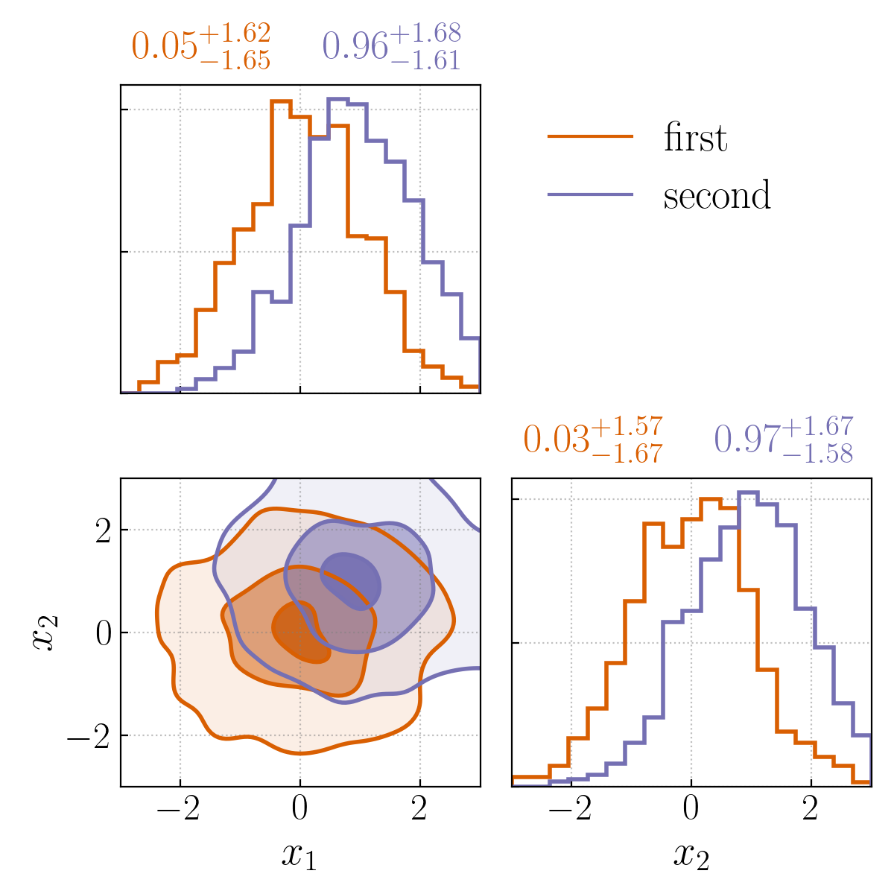
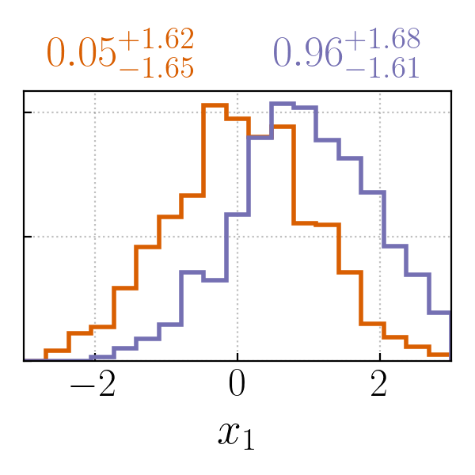
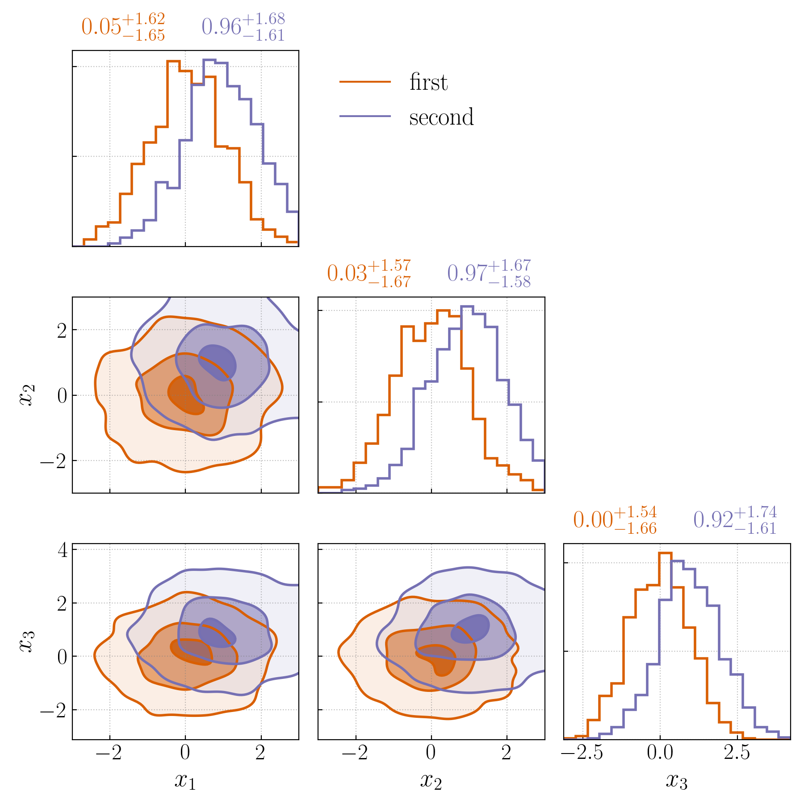
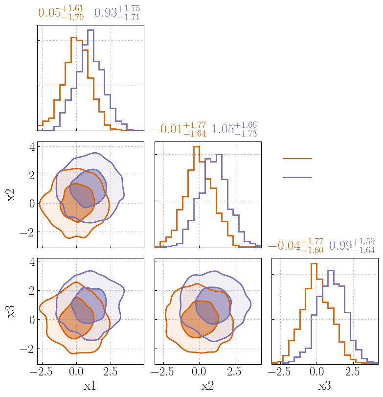
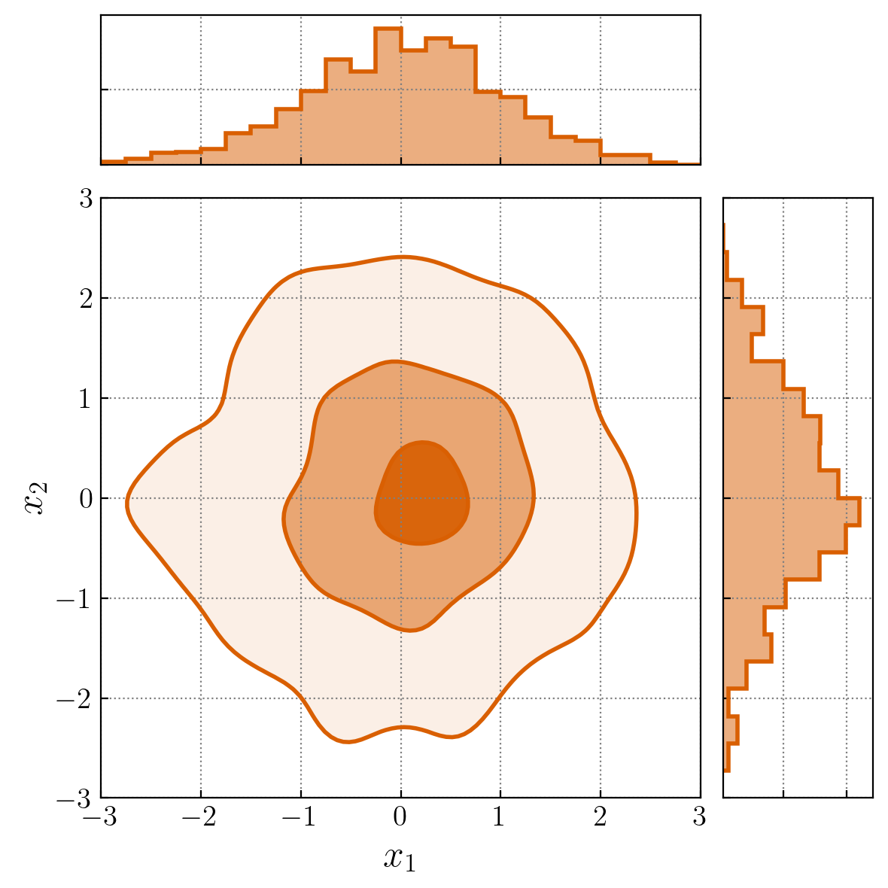
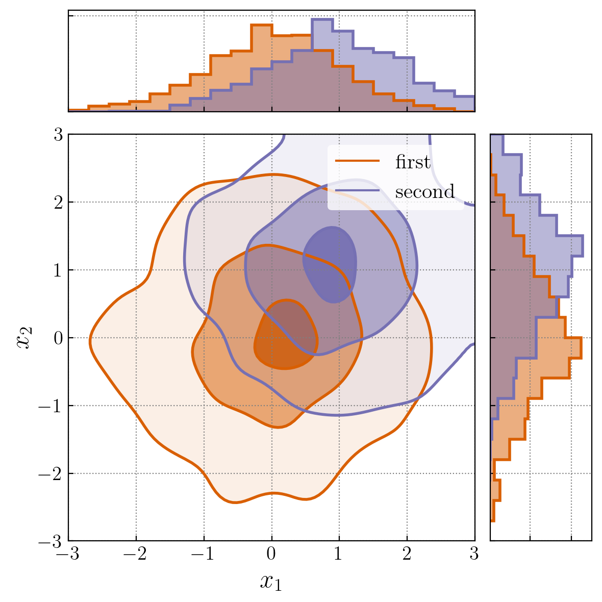
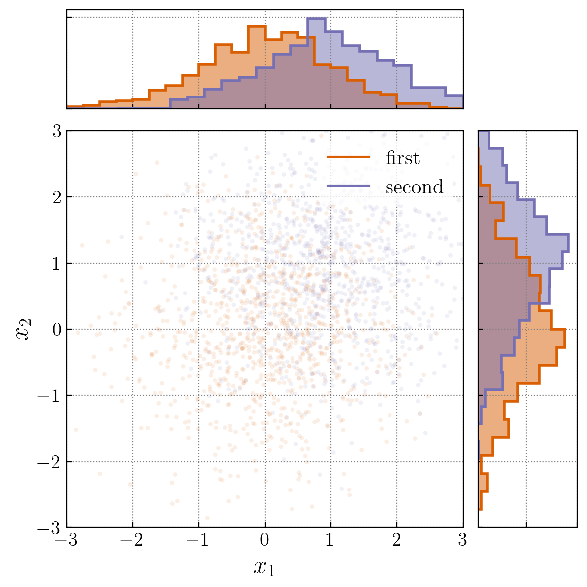

# plot_helper

My custom library to perform quick corner / histogram plots to my liking. Pretty much built on top of the structure / code / style of [`makecorner`](https://github.com/tcallister/makecorner) (check that out if you like that).

- This utilizes boundary unbiased KDEs ala [`truncnormkde`](https://github.com/Potatoasad/truncnormkde) to get better contour shapes at the boundary (use `boundary_bias=True` for that)
- You can also use `boundary_method="reflection"` for a reflection-based bounded KDE instead of the truncnorm-based approach
- Having multiple plots on the same corner with as little friction as possible is a focus

Please let me know if there's something I could be doing better with the styling for a publication ready plot 

Global Plot Defaults
===============================================================

The package now has a mutable global defaults object. By default it uses a square figure sized to the AAS/ApJ half-column width, which is a good default for many corner plots:

```python
from plot_helper import PLOT_DEFAULTS

print(PLOT_DEFAULTS)
```

The global default instance stores:

- `figsize`
- `dpi`
- `latex_font_size`
- `usetex`

and the plotting helpers use those values unless you override them in a specific function call.

To edit the global defaults on the fly:

```python
from plot_helper import configure_plot_defaults

configure_plot_defaults(
    latex_font_size="scriptsize",
    dpi=200,
)
```

If you want the built-in half-column square configuration explicitly, you can still do:

```python
from plot_helper import use_apj_half_column_defaults

use_apj_half_column_defaults(latex_font_size="scriptsize")
```

The supported LaTeX-style font names are:
`"tiny"`, `"scriptsize"`, `"footnotesize"`, `"small"`, `"normalsize"`, `"large"`, `"Large"`, `"LARGE"`, `"huge"`, `"Huge"`.

Following the same idea discussed in Leo Stein's `latex-mpl-fig-tips`, you can also build figure sizes from exact LaTeX widths:

```python
from plot_helper import figure_size_from_width

half_col_square = figure_size_from_width(3.39375, aspect_ratio=1.0)   # inches
prd_onecol = figure_size_from_width(246, aspect_ratio=0.62, units="pt")  # TeX points
```

If you only want the size preset for a single figure, you can pass it directly:

```python
from plot_helper import make_2D_comparison2

fig = make_2D_comparison2(
    df1,
    variables=["x1", "x2"],
    variable_labels=[r"$x_1$", r"$x_2$"],
    a=[-3, -3], b=[3, 3],
    figure_preset="apj_half_column_square",
)
```

You can also inspect the numeric preset values:

```python
from plot_helper import APJ_HALF_COLUMN_SQUARE_FIGSIZE, APJ_DEFAULT_DPI
print(APJ_HALF_COLUMN_SQUARE_FIGSIZE, APJ_DEFAULT_DPI)
```


Usage
===============================================================

Just generate some dummy data

```python
import pandas as pd
from plot_helper import make_corner_plot
import numpy as np

df1 = pd.DataFrame(np.random.randn(1000,3), columns=['x1','x2', 'x3']) # dataset 1
df2 = pd.DataFrame(np.random.randn(1000,3)+1, columns=['x1','x2', 'x3']) # dataset 2

# utility function to make a dictionary of values from a dataframe
make_dict = lambda x: {k:x[k].values for k in x.columns}; 
```

Now lets do a 2D corner plot comparing just x1 and x2:

```python
fig, axes = make_corner_plot(
    all_data = [make_dict(df1), make_dict(df2)],
    model_labels = ["first", "second"],
    variables = ["x1", "x2"],
    variable_labels = [r"$x_1$", r"$x_2$"],
    limits = [(-3,3), (-3,3)],
    nbins=20, kde=True, kde_kwargs=dict(),
    legend_x_position=1, legend_y_position=0,
    quantiles=[0.9, 0.5, 0.1], fill=True, boundary_bias=True, # boundary bias=True uses the truncnormkde to get less boundary bias
    scatter=False
);
```

The same plot using reflection instead of truncnorm boundary handling:

```python
fig, axes = make_corner_plot(
    all_data=[make_dict(df1), make_dict(df2)],
    model_labels=["first", "second"],
    variables=["x1", "x2"],
    variable_labels=[r"$x_1$", r"$x_2$"],
    limits=[(-3, 3), (-3, 3)],
    kde=True, scatter=False,
    quantiles=[0.9, 0.5, 0.1], fill=True,
    boundary_method="reflection",
    boundaries={"x1": [-3, 3], "x2": [-3, 3]},
);
```




Lets plot a 1D histogram comparing just x1:

```python
fig, axes = make_corner_plot(
    all_data = [make_dict(df1), make_dict(df2)],
    model_labels = ["first", "second"],
    variables = ["x1"],
    variable_labels = [r"$x_1$"],
    limits = [(-3,3)],
    nbins=20, kde=True, kde_kwargs=dict(),
    legend_x_position=0, legend_y_position=0,
    quantiles=[0.9, 0.5, 0.1], fill=True, boundary_bias=True, scatter=False
);
```



Lets do a full corner plot of all 3 variables

```python
fig, axes = make_corner_plot(
    all_data = [make_dict(df1), make_dict(df2)],
    model_labels = ["first", "second"],
    variables = ["x1", "x2", "x3"],
    variable_labels = [r"$x_1$", r"$x_2$", r"$x_3$"],
    limits = [(-3,3), (-3,3), None], ## You can choose to not specify limits for some of them
    nbins=20, kde=True, kde_kwargs=dict(),
    legend_x_position=1, legend_y_position=0,
    quantiles=[0.9, 0.5, 0.1], fill=True, boundary_bias=True,
    scatter=False
);
```



You can also omit `model_labels` and `variables`. In that case `model_labels` defaults to blank labels and `variables` is inferred as the ordered union of keys/columns across all datasets:

```python
fig, axes = make_corner_plot(
    all_data=[make_dict(df1), make_dict(df2)],
    kde=True,
    scatter=False,
);
```



For the more flexible side-by-side 2D comparison layout, use `make_2D_comparison2`:

```python
from plot_helper import make_2D_comparison2

fig = make_2D_comparison2(
    df1,
    variables=["x1", "x2"],
    variable_labels=[r"$x_1$", r"$x_2$"],
    a=[-3, -3], b=[3, 3],
)
```



```python
fig = make_2D_comparison2(
    [df1, df2],
    variables=["x1", "x2"],
    variable_labels=[r"$x_1$", r"$x_2$"],
    a=[-3, -3], b=[3, 3],
    model_labels=["first", "second"],
    scatter=False,
    bins=[20, 20],
    boundary_method="reflection",
)
```



You can also draw a scatter plot instead of KDE contours. Each dataset gets a fixed color from the package palette:

```python
fig = make_2D_comparison2(
    [df1, df2],
    variables=["x1", "x2"],
    variable_labels=[r"$x_1$", r"$x_2$"],
    a=[-3, -3], b=[3, 3],
    scatter=True,
    model_labels=["first", "second"],
)
```


