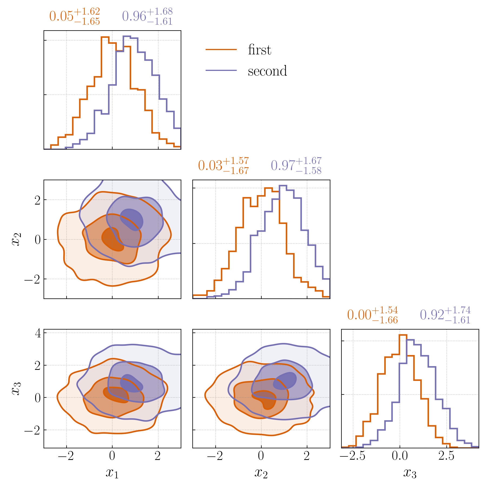

# plot_helper

My custom library to perform quick corner / histogram plots to my liking. Pretty much built on top of the structure / code / style of [`makecorner`](https://github.com/tcallister/makecorner) (check that out if you like that).

- This utilizes boundary unbiased KDEs ala [`truncnormkde`](https://github.com/Potatoasad/truncnormkde) to get better contour shapes at the boundary (use `boundary_bias=True` for that)
- Having multiple plots on the same corner with as little friction as possible is a focus

Please let me know if there's something I could be doing better with the styling for a publication ready plot 


Usage
===============================================================

Just generate some dummy data

```python
import pandas as pd
from plot_helper import make_corner_plot
import numpy as np

df1 = pd.DataFrame(np.random.randn(1000,3), columns=['x1','x2', 'x3']) # dataset 1
df2 = pd.DataFrame(np.random.randn(1000,3)+1, columns=['x1','x2', 'x3']) # dataset 2

# utility function to make a dictionary of values from a dataframe
make_dict = lambda x: {k:x[k].values for k in x.columns}; 
```

Now lets do a 2D corner plot comparing just x1 and x2:

```python
fig, axes = make_corner_plot(
    all_data = [make_dict(df1), make_dict(df2)],
    model_labels = ["first", "second"],
    variables = ["x1", "x2"],
    variable_labels = [r"$x_1$", r"$x_2$"],
    limits = [(-3,3), (-3,3)],
    nbins=20, kde=True, kde_kwargs=dict(),
    legend_x_position=1, legend_y_position=0,
    quantiles=[0.9, 0.5, 0.1], fill=True, boundary_bias=True, # boundary bias=True uses the truncnormkde to get less boundary bias
    scatter=False
);
```


Lets plot a 1D histogram comparing just x1:

```python
fig, axes = make_corner_plot(
    all_data = [make_dict(df1), make_dict(df2)],
    model_labels = ["first", "second"],
    variables = ["x1"],
    variable_labels = [r"$x_1$"],
    limits = [(-3,3)],
    nbins=20, kde=True, kde_kwargs=dict(),
    legend_x_position=0, legend_y_position=0,
    quantiles=[0.9, 0.5, 0.1], fill=True, boundary_bias=True, scatter=False
);
```


Lets do a full corner plot of all 3 variables

```python
fig, axes = make_corner_plot(
    all_data = [make_dict(df1), make_dict(df2)],
    model_labels = ["first", "second"],
    variables = ["x1", "x2", "x3"],
    variable_labels = [r"$x_1$", r"$x_2$", r"$x_3$"],
    limits = [(-3,3), (-3,3), None], ## You can choose to not specify limits for some of them
    nbins=20, kde=True, kde_kwargs=dict(),
    legend_x_position=1, legend_y_position=0,
    quantiles=[0.9, 0.5, 0.1], fill=True, boundary_bias=True,
    scatter=False
);
```


